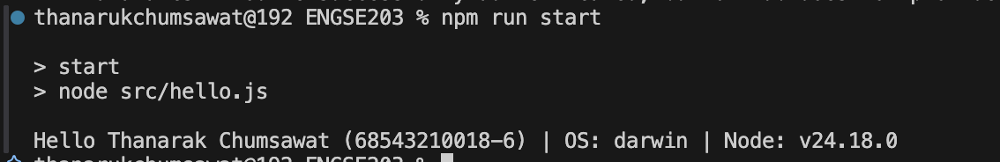
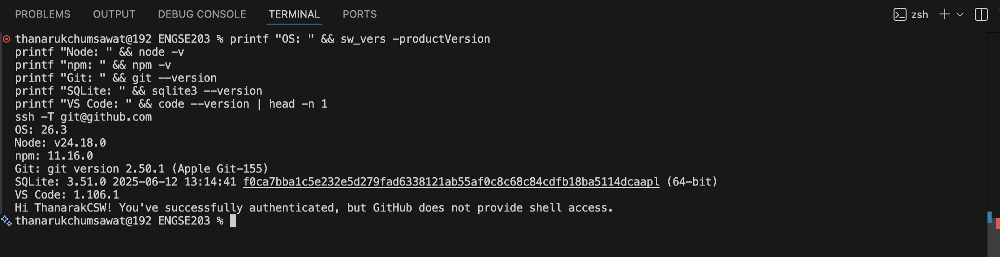

# LAB 01 — Developer Environment & GitHub Repository Setup

<p align="center">
  
  =LTS-green?style=for-the-badge&logo=node.js" alt="Node">
  
</p>

---

## 👤 ผู้จัดทำ
* **ชื่อ-นามสกุล:** ธนรัก ชุ่มสวัสดิ์
* **รหัสนักศึกษา:** 68543210018-6
* **ระบบปฏิบัติการที่ใช้:** macOS

---

🎯 วัตถุประสงค์ของงาน
1. เพื่อตรวจสอบและตั้งค่าสภาพแวดล้อมสำหรับการพัฒนาโปรแกรมสมัยใหม่ (Node.js, npm, VS Code และ Git)
2. เพื่อศึกษาการสร้างและจัดการโครงงาน JavaScript ขนาดเล็กด้วย `package.json` และ npm script
3. เพื่อฝึกฝนการใช้งาน Git และ GitHub Workflow สำหรับการพัฒนาซอร์สโค้ดและการส่งงานร่วมกัน

---

## 🛠️ เครื่องมือที่ใช้
* **Runtime:** Node.js (LTS Version) & npm
* **Editor:** Visual Studio Code
* **Version Control:** Git & GitHub (Authentication via SSH Key)

---

## 🚀 วิธีติดตั้งและรันโปรแกรม

ก่อนการรันโปรแกรม ตรวจสอบให้มั่นใจว่าได้ติดตั้ง Node.js เรียบร้อยแล้ว จากนั้นเปิด Terminal ในโฟลเดอร์โปรเจกต์แล้วใช้คำสั่ง:
```bash
npm run start
```

## 📂 โครงสร้างไฟล์ (Project Structure)
```bash
engse203-lab01/
├── src/
│   └── hello.js        # ไฟล์หลักในการรันแสดงข้อมูลนักศึกษา
├── package.json        # ไฟล์จัดการ dependencies และ npm scripts
└── README.md           # เอกสารสรุปรายงานปฏิบัติการ
```

## 📝 หลักฐานผลลัพธ์ (Execution Result)
โปรแกรมสามารถทำงานผ่านระบบ npm script ได้อย่างถูกต้อง โดยทำการประมวลผลและแสดงผลลัพธ์ข้อมูลผู้จัดทำ, ระบบปฏิบัติการที่ใช้จริง รวมถึงเวอร์ชันของ Node.js ในเครื่องได้ถูกต้องตามข้อกำหนดของใบงาน ดังนี้:
* **ข้อมูลที่แสดง:** Hello ธนารักษ์ ชุมสวัสดิ์ (68543210018-6) | OS: darwin | Node: <version>


## 🔍 ปัญหาที่พบและวิธีแก้ไข (Troubleshooting)
* **ปัญหาที่พบ:** เกิดข้อผิดพลาด fatal: not a git repository (or any of the parent directories): .git เมื่อพยายามใช้คำสั่งผูก Remote (git remote add) และการจัดการ Branch
* **สาเหตุ:** ตัวโฟลเดอร์โปรเจกต์ยังไม่ได้ถูกริเริ่มสร้างระบบ Local Git Repository ขึ้นมาในเครื่อง
* **วิธีแก้ไข:** ทำการรันคำสั่ง git init เพื่อเริ่มต้นสร้างระบบ Git ภายในโฟลเดอร์ก่อน จากนั้นจึงทำการเพิ่มไฟล์และ Commit งานด้วย git add . และ git commit -m "..." ให้เรียบร้อย ก่อนจะรันชุดคำสั่งเพื่อเชื่อมต่อกับ GitHub และทำการ Push งานขึ้นระบบในขั้นตอนต่อไป

## 📚 References & AI Assistance
* **Source / Documentation:** เอกสารใบงาน LAB 01 — Developer Environment & GitHub Repository Setup (รายวิชา ENGSE203)
* **AI Tool Used:** Gemini
* **Used for:**
ตรวจสอบความถูกต้องของคำสั่งสร้างคีย์ความปลอดภัย (ssh-keygen)
วิเคราะห์ปัญหาและสาเหตุของ Error จากภาพหน้าจอ Terminal
ช่วยเรียบเรียงและจัดรูปแบบ Markdown ให้ออกมาสวยงามและเป็นระเบียบ
* **My Adaptation:** นำแนวทางการแก้ไขมาเรียงลำดับขั้นตอนของคำสั่ง Git ให้ถูกต้องตามลำดับขั้นตอน (สร้าง repository ก่อนผูก remote) และแก้ไขเครื่องหมายคำพูดในการสร้างคีย์ให้ตรงตามข้อกำหนดของ Terminal บนระบบปฏิบัติการ
